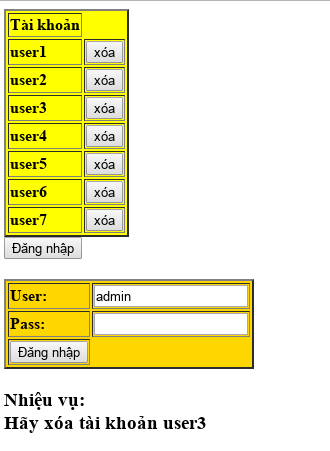

## Challenge 04

| Link |
| ---- |
| http://hotamago.esy.es/testhacker/emlacongai.html |

<p align="center">
  
</p>

### WriteUp

- Phần này có vẻ phức tạp hơn các phần trước. Nhiệm vụ của chúng ta là phải xoá `user3` bằng 1 cách nào đó. Bấm `xoá` cmnl cho nhanh chớ :v.
```
Chỉ có admin mới được xóa tài khoản!
```

- Vậy là chỉ `admin` mới có quyền xoá, tưởng bấm xoá cái là xoá luôn thì chán lắm >"<. Tìm cách khác thôi, suy nghĩ theo lối đơn giản là tìm cách login vào tài khoản admin mà xoá. `viewsource` tiếp (cả đời của 1 thằng IT là đoc code, đọc code và đoc code mà :D).
```javascipt
//ádasdddddddd
	 		function des(){//ádasdddddddd
			//ádasdddddddd//ádasdddddddd//ádasdddddddd//ádasdddddddd//ádasdddddddd
			//ádasdddddddd//ádasdddddddd//ádasdddddddd//ádasdddddddd
			//ádasdddddddd//ádasdddddddd//ádasdddddddd
				document.getElementById("html").innerHTML = "<h1 style=\"color: red;\">Xóa sai tài khoản!</h1>";//ádasdddddddd//ádasdddddddd//ádasdddddddd//ádasdddddddd
            }//ádasdddddddd//ádasdddddddd//ádasdddddddd//ádasdddddddd
          function des1(){//ádasdddddddd//ádasdddddddd//ádasdddddddd
		   var user;//ádasdddddddd//ádasdddddddd//ádasdddddddd
		   //ádasdddddddd//ádasdddddddd/ádasdddddddd//ádasdddddddd
		    //ádasdddddddd//ádasdddddddd/ádasdddddddd//ádasdddddddd
			 //ádasdddddddd//ádasdddddddd/ádasdddddddd//ádasdddddddd
	  var pass = document.getElementById("pass").value;//ádasdddddddd//ádasdddddddd//ádasdddddddd
	  //ádasdddddddd//ádasdddddddd//ádasdddddddd
	   //ádasdddddddd//ádasdddddddd/ádasdddddddd//ádasdddddddd
                if(user=="nothing" && pass=="123456789"){//ádasdddddddd//ádasdddddddd//ádasdddddddd
				 //ádasdddddddd//ádasdddddddd/ádasdddddddd//ádasdddddddd //ádasdddddddd//ádasdddddddd/ádasdddddddd//ádasdddddddd //ádasdddddddd//ádasdddddddd/ádasdddddddd//ádasdddddddd
				  //ádasdddddddd//ádasdddddddd/ádasdddddddd//ádasdddddddd //ádasdddddddd//ádasdddddddd/ádasdddddddd//ádasdddddddd
				   //ádasdddddddd//ádasdddddddd/ádasdddddddd//ádasdddddddd
				    //ádasdddddddd//ádasdddddddd/ádasdddddddd//ádasdddddddd //ádasdddddddd//ádasdddddddd/ádasdddddddd//ádasdddddddd
				window.location="awhbuur.php?id=386192&cos=1ya82"; //ádasdddddddd//ádasdddddddd/ádasdddddddd//ádasdddddddd //ádasdddddddd//ádasdddddddd/ádasdddddddd//ádasdddddddd
				//ádasdddddddd//ádasdddddddd
				 //ádasdddddddd//ádasdddddddd/ádasdddddddd//ádasdddddddd
				  //ádasdddddddd//ádasdddddddd/ádasdddddddd//ádasdddddddd
				} //ádasdddddddd//ádasdddddddd/ádasdddddddd//ádasdddddddd //ádasdddddddd//ádasdddddddd/ádasdddddddd//ádasdddddddd
				else{ //ádasdddddddd//ádasdddddddd/ádasdddddddd//ádasdddddddd //ádasdddddddd//ádasdddddddd/ádasdddddddd//ádasdddddddd
				 //ádasdddddddd//ádasdddddddd/ádasdddddddd//ádasdddddddd //ádasdddddddd//ádasdddddddd/ádasdddddddd//ádasdddddddd
				document.getElementById("html").innerHTML = "<h1 style=\"color: red;\">Chỉ có admin mới được xóa tài khoản!</h1>"; //ádasdddddddd//ádasdddddddd/ádasdddddddd//ádasdddddddd //ádasdddddddd//ádasdddddddd/ádasdddddddd//ádasdddddddd //ádasdddddddd//ádasdddddddd/ádasdddddddd//ádasdddddddd
				} //ádasdddddddd//ádasdddddddd/ádasdddddddd//ádasdddddddd //ádasdddddddd//ádasdddddddd/ádasdddddddd//ádasdddddddd //ádasdddddddd//ádasdddddddd/ádasdddddddd//ádasdddddddd
            }
```

- Lại kiểu obfuscate "dễ nhìn" đó nữa.
```javascript
function des(){
  document.getElementById("html").innerHTML = "<h1 style=\"color: red;\">Xóa sai tài khoản!</h1>";
}
function des1(){
  var user;
	var pass = document.getElementById("pass").value;
  if(user=="nothing" && pass=="123456789"){
  	window.location="awhbuur.php?id=386192&cos=1ya82";
	}
	else{
	 document.getElementById("html").innerHTML = "<h1 style=\"color: red;\">Chỉ có admin mới được xóa tài khoản!</h1>";
	}
}
```

- Để ý thấy 1 phần nữa
```html
<tr><td><strong>user1</strong></td><td><input type="button" value="xóa" id="s1" onclick="des()"></td></tr>
<tr><td><strong>user2</strong></td><td><input type="button" value="xóa" id="s2" onclick="des()"></td></tr>
<tr><td><strong>user3</strong></td><td><input type="button" value="xóa" id="s3" onclick="des1()"></td></tr>
<tr><td><strong>user4</strong></td><td><input type="button" value="xóa" id="s4" onclick="des()"></td></tr>
<tr><td><strong>user5</strong></td><td><input type="button" value="xóa" id="s5" onclick="des()"></td></tr>
<tr><td><strong>user6</strong></td><td><input type="button" value="xóa" id="s6" onclick="des()"></td></tr>
<tr><td><strong>user7</strong></td><td><input type="button" value="xóa" id="s7" onclick="des()"></td></tr>
```

- Có thể thấy `user3` có 1 event onclick khác là `des1()`, vì vậy chỉ cần focus vào hàm này mà thôi. Nhưng mà trong hàm đó, thật ra là mình phải làm theo thủ tục là login với `nothing | 123456789` trước, nhưng mà có dòng `window.location="awhbuur.php?id=386192&cos=1ya82";` thế kia thì vào hẳn URI đó cho nhanh, thủ tục rườm rà :D.
```
http://hotamago.esy.es/testhacker/awhbuur.php?id=386192&cos=1ya82
```
