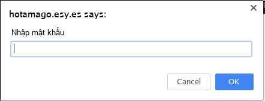

## Challenge 05

| Link |
| ---- |
| http://hotamago.esy.es/testhacker/hocsinhlop8.html |

<p align="center">
  
</p>

### WriteUp

- Ù ui, `promt` luôn, nhưng không sao, chúng ta cứ `viewsource`.
```javascript
function pass()
{
var pw, Eingabe;
pw=window.document.alinkColor;
Eingabe=prompt ("Nhập mật khẩu");
if (Eingabe==pw)
{
alert("Chúc mừng! bạn đã hack thành công!");
window.location.href="hotavn.html";
}
else
{
alert("Thử lại");
}
```

- Chà, phần này có 2 cách giải quyểt
  - **Cách 1**: Là chúng ta cứ làm theo thủ tục. `pw=window.document.alinkColor;`, tìm đoạn source có attr `alink` rồi điền pass vào thôi.
  ```
  <body onload=javascript:pass(); alink="#000000">
  ```
  - **Cách 2**: Tại sao phải theo thủ tục khi có dòng `window.location.href="hotavn.html";`, cứ thế mà tiến quân thôi.
  ```
  http://hotamago.esy.es/testhacker/hotavn.html
  ```
