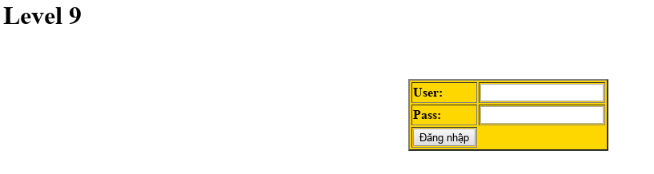

## Challenge 09

| Link |
| ---- |
| http://hotamago.esy.es/testhacker/sieunhanmacsip.html |

<p align="center">
  
</p>

### WriteUp

- Lại trở lại với 1 form đăng nhập, nhưng lần này không còn là form tĩnh như trước nữa mà được ẩn sourcecode bằng PHP.
```html
<form method="post" action="pwt.php">
<table style="background: gold;" border="2">
<tr><td><strong>User: </strong></td><td><input type="text" name="user"></td></tr>
<tr><td><strong>Pass: </strong></td><td><input type="text" name="pass"></td></tr>
<tr><td><input type="submit" name="login" value="Đăng nhập"></td></tr>
```

- Bấm vô link thử.
```
http://hotamago.esy.es/testhacker/pwt.php
```

- Trống lóc, nhưng vấn đề này không dừng lại ở đó. Quay lại với trang chính, với kinh nghiệm soi gái bao nhiêu năm, làm sao có thể bỏ qua chi tiết này chứ.
```html
<body p="ituen.html">
```

- Hề hế hê.
```
http://hotamago.esy.es/testhacker/ituen.html
```
```html
<div style="font-size:3">User: hotaer | Pass: h8hf982da23f</div>
```

- Thế thôi :D.
```
hotaer | h8hf982da23f
```
