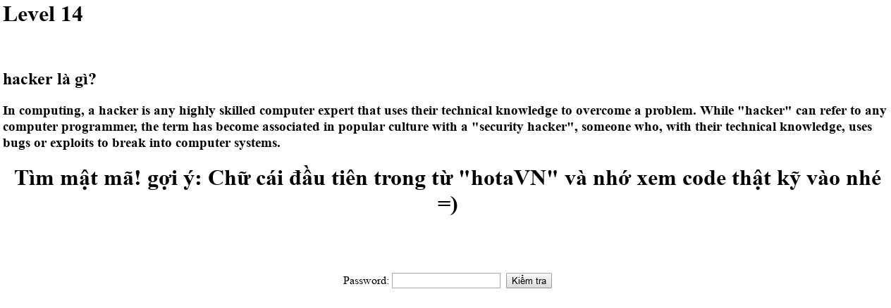

## Challenge 14

| Link |
| ---- |
| http://hotamago.esy.es/testhacker/emyeuoniichan.php |

<p align="center">
  
</p>

### WriteUp

- *Chữ cái đầu tiên trong từ "hotaVN"*, chắc có cái gì đó liên quan đến chữ `h`.
```html
<h3>In computing, a hacker <h>is</h> any highly skilled computer expert that uses their technical knowledge to overcome <h>a</h> problem. While "hacker" can refer <h>to</h> any computer programmer, the term has become associated <h>in</h> popular culture with a "security hacker", someone who, with their technical knowledge, uses bugs <h>or</h> exploits to break into computer systems.</h3>
```

- Để ý kĩ, đoạn văn bản có những chỗ được sử dụng tag `<h></h>`, để làm gì nhỉ? Nhưng chả quan tâm, ngồi ghép đống chữ đó lại thôi.
```
isatoinor
```

- Hế hế, lại qua cửa.
