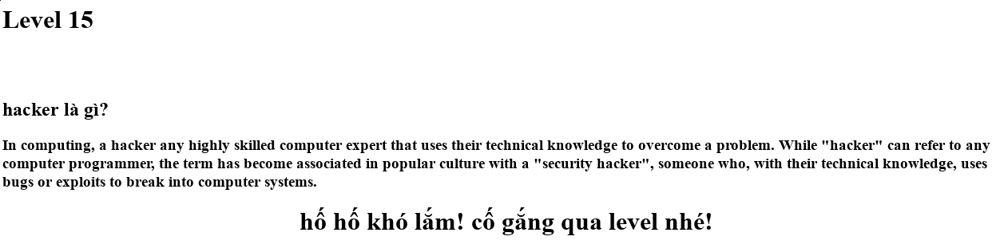

## Challenge 15

| Link |
| ---- |
| http://hotamago.esy.es/testhacker/haythudi.html |

<p align="center">
  
</p>

### WriteUp

- Giống bài trước nhỉ
```html
In computing, a hacker  any highly skilled computer expert
that uses their technical knowledge to overcome <h>a</h> problem. While "hacker" can refer <h>to</h> any computer
programmer, the term has become associated <h>in</h> popular culture with a "security hacker", someone who, with their
technical knowledge, uses bugs <h>or</h> exploits to break into computer systems.
```

- Những chữ có tag `<h></h>`, nhưng mà có gì đó không đúng, ghép xong rồi làm gì nữa khi mà không có form để nhập vào?

- Lại 1 lần nữa thánh soi trổ tài, đánh lừa người chơi bằng câu nói *khó lắm* và những bước giống bài trước, nhưng tui không bị lừa đâu.
```html
<meta name="robots" content="goto: lolgame.html">
```

- Tưởng khó hoá ra dễ hơn level1 :D.
```
http://hotamago.esy.es/testhacker/lolgame.html
```
