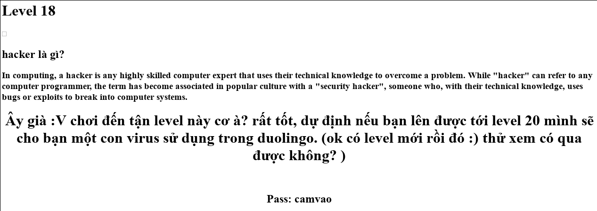

## Challenge 18

| Link |
| ---- |
| http://hotamago.esy.es/testhacker/haylambanoi.html |

<p align="center">
  
</p>

### WriteUp

- Source chả có gì hot, vụ này căng, không có gì đăc biệt luôn. Nhưng chợt nhớ ở level17 là 1 bài sử dụng kỹ thuật giấu tin, thôi thì cứ thử xem, tải hình `logo.png` về mà phân tích.

- Sử dụng công cụ `binwalk` để phân tích các giấu tin đơn giản trong các file.
```
$ binwalk logo.png
```
```
DECIMAL       HEXADECIMAL     DESCRIPTION
```
```
0             0x0             PNG image, 600 x 600, 8-bit/color RGBA, interlaced
62            0x3E            Zlib compressed data, best compression
22304         0x5720          7-zip archive data, version 0.4
```

- Ố ồ, có 1 header `7zip` ở đâu đó bên trong, thử extract ra xem.
```
$  7za e logo.png
Scanning the drive for archives:
```
```
1 file, 22626 bytes (23 KiB)
Extracting archive: logo.png
--
Path = logo.png
Type = 7z
Offset = 22304
Physical Size = 322
Headers Size = 226
Method = LZMA2:12 7zAES
Solid = -
Blocks = 2
```
```
Enter password (will not be echoed):
```

- Password à, `camvao` chứ còn gì nữa =)).
```
Everything is Ok           
Folders: 1
Files: 2
Size:       73
Compressed: 22626
```
```
$  cat YourFile.txt
copassilikeit
```

- Lại đoán đuôi ..
```
http://hotamago.esy.es/testhacker/copassilikeit.php
```
